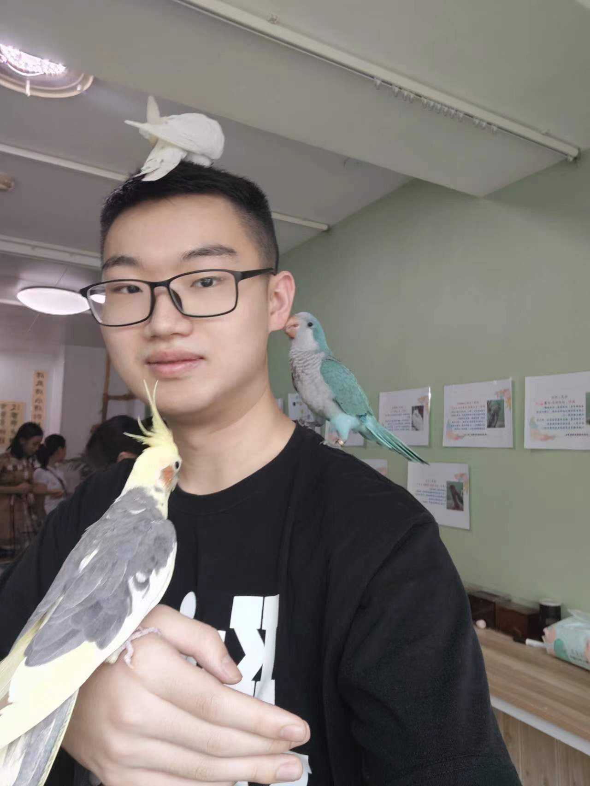
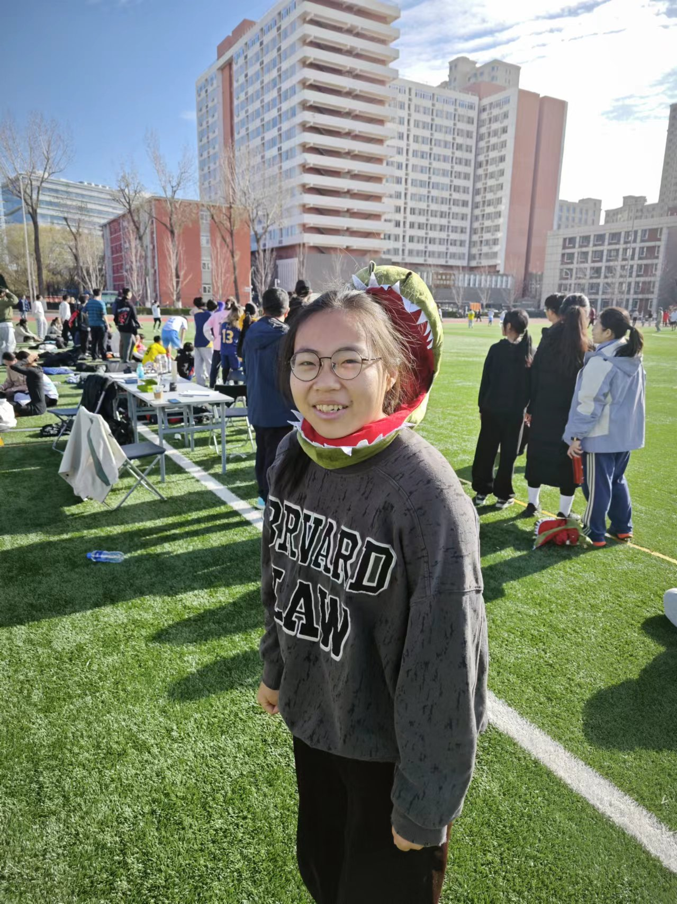
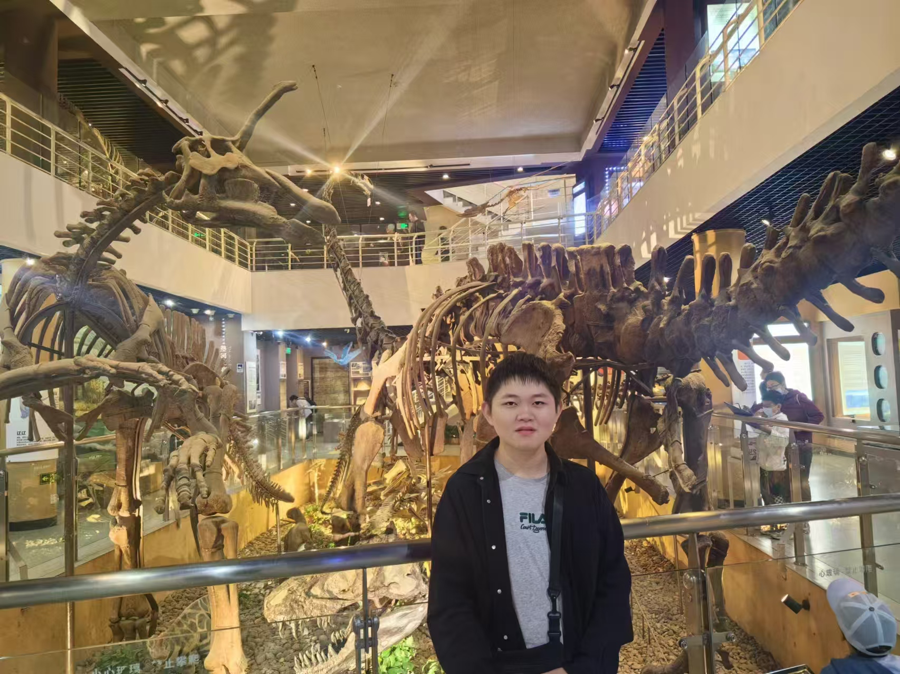




<h1>Graduate Students</h1>

  

    <h2>Liping Wang</h2>
    
<strong>Email:</strong> 13955672307@163.com

  

  

    
  

  

  

    <h2>Chuwei Liu</h2>
    
<strong>Email:</strong> myrtleliu@foxmail.com

  

  

    
  

  

<!-- 新增研究生 -->

  

    <h2>Jinghan Zhou</h2>
    
<strong>Email:</strong> jms@cau.edu.cn 

  

  

    
  

  

  

    <h2>Wenjing He</h2>
    
<strong>Email:</strong> 2906846292@qq.com

  

  

    
  

  

<h1>Undergraduate Students</h1>

  

    <h2>Quanhao Hui</h2>
    
<strong>Email:</strong> 2023302050138@cau.edu.cn

  

  

    
  

  

  

    <h2>Yu'ang Teng</h2>
    
<strong>Email:</strong> 19861368534@163.com

  

  

    
  

  

  

    <h2>Tao Li</h2>
    
<strong>Email:</strong> lt0506036666@qq.com

  

  

    
  

  

<!-- 新增本科生 -->

  

    <h2>Yiping Han</h2>
    
<strong>Email:</strong> 2024333010118@cau.edu.cn

  

  

    
  

  

  

    <h2>Sihan Teng</h2>
    
<strong>Email:</strong> tengsh0911@qq.com

  

  

    
  

  

<h1>Alumni</h1>

  

    <h2>Dajun Hong</h2>
    
<strong>Email:</strong> dachunhorng@gmail.com

  

  

    
  

  

